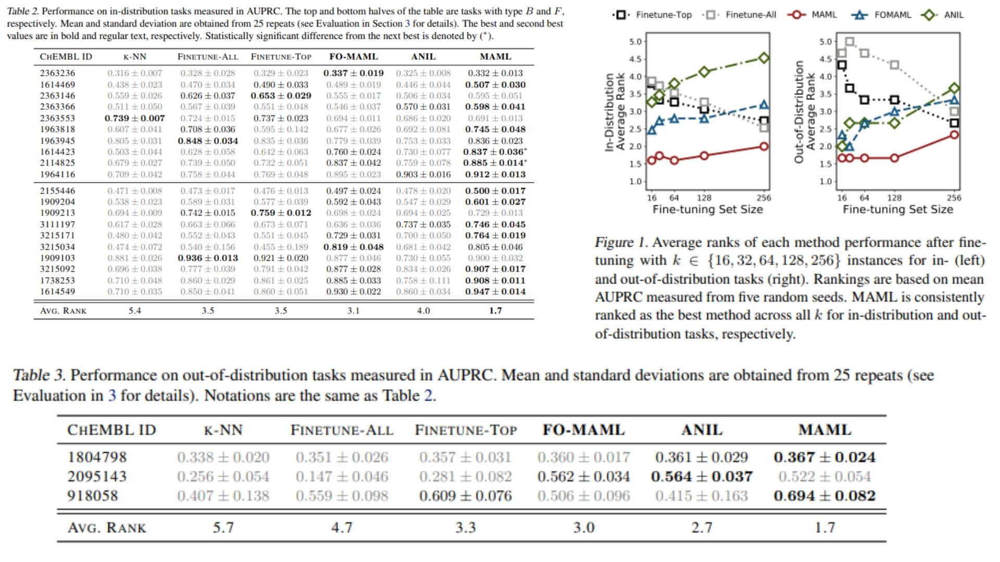

# 🌌 MetaGNN-MAML-Replication — Graph-Based Molecular Property Prediction

This repository provides a **forward-only PyTorch replication** of the  
**MetaGNN architecture with MAML** for molecular property prediction.

The focus is on **faithful replication of the paper’s math and structure**, not benchmark optimization.  
It reproduces the core MetaGNN formulation — **GGNN-based message passing, edge-specific transformations, and meta-learning adaptation** — in concise, readable code.

Highlights include:

- Atom and bond embeddings propagation through GGNN blocks 🔄  
- Edge-specific weight matrices for bond-aware message passing ✨  
- Meta-learning inner/outer loops for task adaptation 🧩  

Paper reference: [MetaGNN-MAML: Graph Neural Networks with Meta-Learning for Molecular Property Prediction](https://arxiv.org/abs/2003.05996)

---

## Overview — Molecular Graph Modeling 🜂



> Molecular properties emerge from atom types, bonds, and their relational structure.

MetaGNN integrates:

- **GGNN encoder** for message passing over molecular graphs  
- **Edge networks** generating bond-specific transformations  
- **Residual updates** and readout for molecule-level prediction  
- **MAML / ANIL meta-learning** for fast adaptation to new molecular tasks  

This produces **graph-aware, task-adaptive molecular property predictions**.

---

## Molecular Graph Representation ⚗︎

A molecule is represented by a graph:

$$
G = (V, E), \quad V = \{v_1, v_2, ..., v_n\}, \quad E = \{(v_i, v_j, e_{ij})\}
$$

with node features:

$$
h_i^0 = \text{AtomEmbed}(Z_i) \in \mathbb{R}^{F}
$$

and bond features $e_{ij}$ processed by an **edge network**:

$$
A_{ij} = \text{EdgeNetwork}(e_{ij}) \in \mathbb{R}^{F \times F}
$$

---

## GGNN Message Passing 🔄

Each node’s hidden state is updated via:

$$
m_v = \sum_{w \in \mathcal{N}(v)} A_{vw} h_w
$$

$$
h_v^{t+1} = \text{GRU}(m_v, h_v^t)
$$

Repeated for $T$ steps, this captures **neighbor and higher-order interactions** while maintaining **bond-awareness**.

---

## Readout Phase 🜁

After message passing, atom features are aggregated:

$$
\hat{y} = \text{Readout}\Big(h_1^T, h_2^T, ..., h_n^T\Big)
$$

This yields **molecular property predictions** (scalar or vector) per molecule.

---

## Meta-Learning Adaptation 🧩

Meta-learning adapts the model to new tasks:

- **MAML:** Inner loop adapts **all model parameters** to a task:

$$
\theta' = \theta - \alpha \nabla_\theta \mathcal{L}_\text{support}(\theta)
$$

Outer loop updates the **meta-parameters** $\theta$ using the adapted parameters $\theta'$:

$$
\theta \gets \theta - \beta \nabla_\theta \sum_\text{tasks} \mathcal{L}_\text{query}(\theta')
$$

- **ANIL:** Inner loop updates **only the prediction head**, keeping the encoder fixed.

- **FOMAML (First-Order MAML):** Approximates MAML by **ignoring second-order gradients**, i.e., it does not compute gradients through the inner-loop updates. This makes training faster with slightly less precise meta-updates.

- **TaskSampler:** Generates random support/query splits per task for meta-learning.


---

## Why MetaGNN-MAML Matters 🧪

- Captures **graph-level relational structure** of molecules  
- Enables **fast adaptation** to new molecular prediction tasks  
- Maintains **readable, faithful replication** of the paper’s math and blocks  
- Minimal implementation for education, research, and replication

---

## Repository Structure 🗂

```bash
MetaGNN-MAML-Replication/
├── src/
│
│   ├── encoder/
│   │   ├── ggnn_encoder.py        # Message passing (m_v, h_v updates)
│   │   ├── edge_network.py        # Bond-specific weight matrices A_evw
│   │   └── readout.py             # Sum aggregation + MLP output (ŷ)
│
│   ├── meta_learning/
│   │   ├── maml.py                # MAML inner/outer loop equations
│   │   ├── fo_maml.py             # First-order MAML (no second-order grads)
│   │   ├── anil.py                # Head-only adaptation (ANIL variant)
│   │   └── task_sampler.py        # Task creation for meta-learning
│
│   ├── model/
│   │   └── meta_gnn_model.py      # Encoder + prediction head
│
│   └── config.py                  # Paper hyperparameters
│
├── images/
│   └── figmix.jpg                  # Model overview figure
│
├── requirements.txt
└── README.md
```
---


## 🔗 Feedback

For questions or feedback, contact: [barkin.adiguzel@gmail.com](mailto:barkin.adiguzel@gmail.com)
